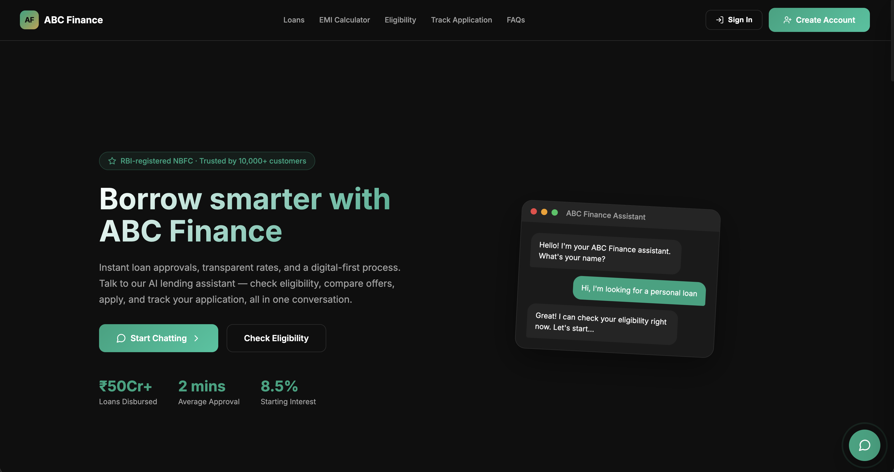
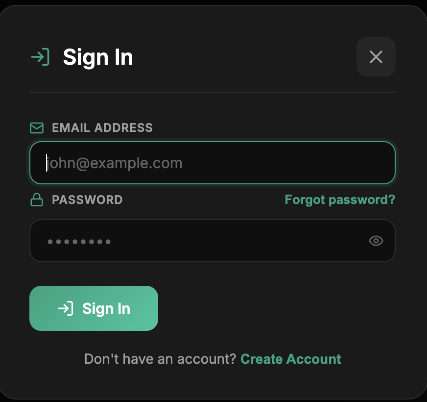
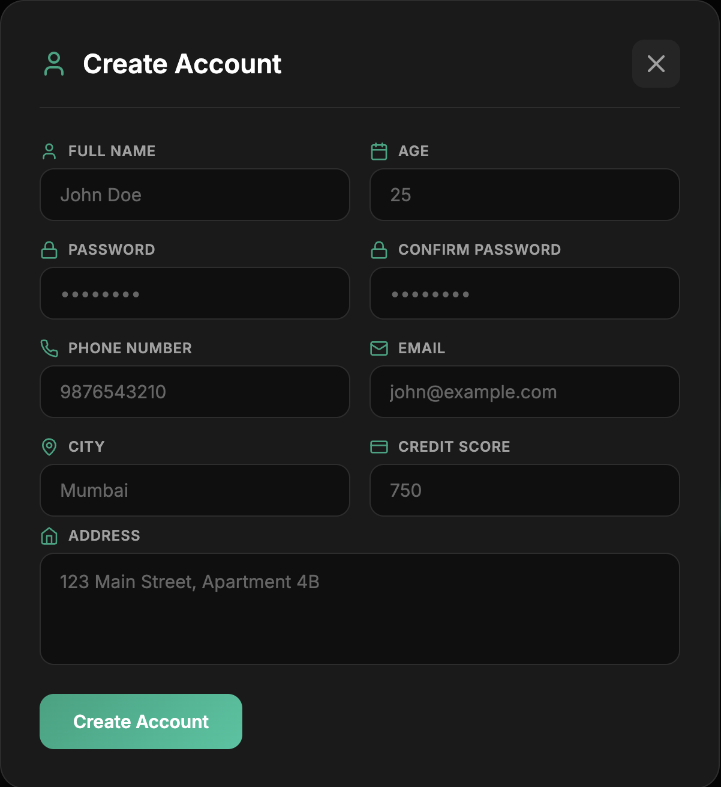
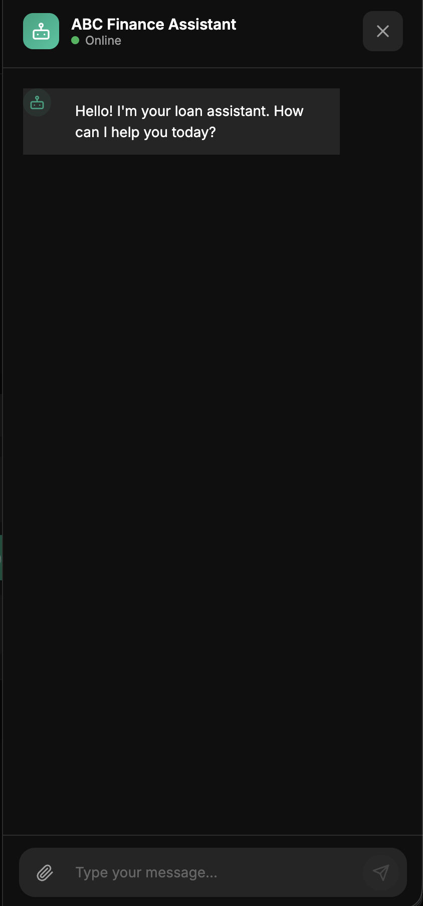
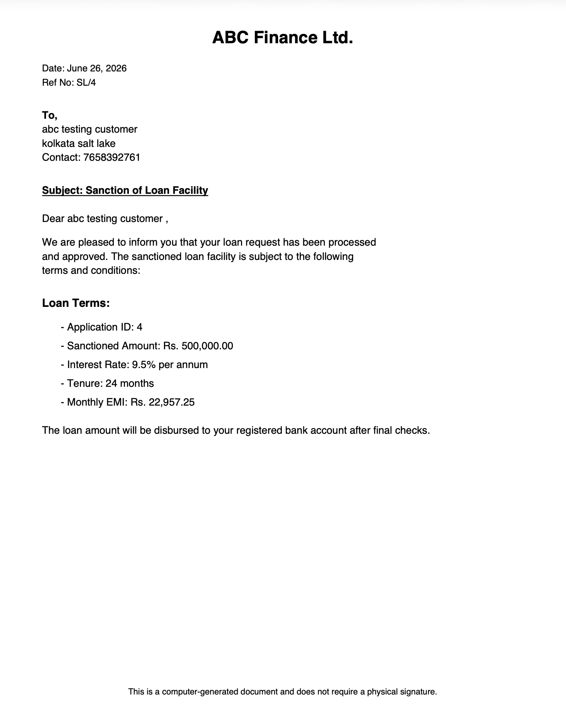

# Loan Sales Agent

An Agentic AI-based loan sales assistant built for NBFCs (Non-Banking Financial Companies) to automate customer interactions and end-to-end loan processing using a multi-agent workflow.

[](https://github.com/DeXtAr47-oss/Loan-sales-agent)


---

## Overview

The Loan Sales Agent is an intelligent, conversational AI system designed to streamline the loan application process for NBFCs. It replaces traditional manual workflows with an automated multi-agent pipeline that handles everything from customer identification to sanction letter generation.

The system uses LangGraph to orchestrate multiple specialized AI agents, each responsible for a distinct stage of the loan lifecycle. A Master Agent coordinates the entire workflow, routing customers through the appropriate agent based on their current stage.

---

## Features

- AI-powered conversational interface for customer interactions
- Multi-agent pipeline: Sales, Verification, Underwriting, and Sanction agents
- Automated KYC document verification
- Credit score retrieval and EMI calculation
- Rule-based loan eligibility assessment
- Automatic sanction letter generation upon approval
- JWT-based authentication and session management
- Persistent conversation memory using Pinecone vector database
- RESTful APIs built with FastAPI
- React-based frontend dashboard

---

## Screenshots

### Landing Page


### Sign In Page


### Create Account Page


### Chat Section


### Generated Sanction Letter


---

## System Architecture

```
Client Layer (Frontend)
    Web Browser | React UI | HTML5, CSS3, JavaScript (ES6+)
            |
            v
Server Layer (Backend)
    FastAPI Server (Python 3.9+)
    Session Manager | LangGraph Orchestrator | Database Pool
            |
            v
AI Layer (Agentic Intelligence)
    Master Agent (Orchestrator)
    ├── Sales Agent
    ├── Verification Agent
    ├── Underwriting Agent
    └── Sanction Letter Agent
            |
            v
Data Layer
    PostgreSQL (Port 5432) | Pinecone Vector DB
    Tables: customers, credit_scores, loan_applications, checkpoints
```

---

## Tech Stack

| Layer | Technology |
|---|---|
| Frontend | React, HTML5, CSS3, JavaScript (ES6+) |
| Backend | FastAPI, Python 3.9+ |
| AI / Agents | LangGraph, LangChain, Google Gemma LLM |
| Auth | Python Jose (JWT), OAuth2 |
| Database | PostgreSQL, Pinecone Vector DB |
| ORM / Migration | SQLAlchemy, Alembic |
| Validation | Pydantic |
| Protocol | MCP (Model Context Protocol) |

---

## Agents

### Master Agent
The central orchestrator that manages conversation flow and routes customers to the appropriate specialized agent based on their current stage in the loan process.

### Sales Agent
Handles initial customer interaction. Collects loan requirements including loan amount, tenure, and loan purpose. Stores customer requirements for downstream processing.

### Verification Agent (KYC)
Validates KYC documents uploaded by the customer. Verifies personal, employment, and income details. Prompts re-upload if documents are invalid or incomplete.

### Underwriting Agent
Retrieves the customer's credit score and calculates EMI and repayment capacity. Compares the requested loan amount against the pre-approved limit and evaluates eligibility rules to mark the loan as approved or rejected.

### Sanction Agent
Generates the official loan sanction letter upon successful underwriting approval. Stores approval details in the database and notifies the customer with the final loan decision.

---

## Project Structure

```
loan-sales-agent/
├── backend/
│   ├── agents/
│   │   ├── master_agent.py
│   │   ├── sales_agent.py
│   │   ├── verification_agent.py
│   │   ├── underwriting_agent.py
│   │   └── sanction_agent.py
│   ├── api/
│   │   ├── auth.py
│   │   ├── chat.py
│   │   └── loans.py
│   ├── db/
│   │   ├── models.py
│   │   ├── database.py
│   │   └── migrations/
│   ├── schemas/
│   │   └── pydantic_models.py
│   ├── utils/
│   │   ├── jwt_handler.py
│   │   └── pinecone_client.py
│   └── main.py
├── frontend/
│   ├── public/
│   └── src/
│       ├── components/
│       ├── pages/
│       └── App.jsx
├── screenshots/
│   ├── landing_page.png
│   ├── signin_page.png
│   ├── create_account_page.png
│   ├── chat_section.png
│   └── sanction_letter.png
├── alembic.ini
├── requirements.txt
├── .env.example
└── README.md
```

---

## Installation

### Prerequisites

- Python 3.9+
- Node.js 18+
- PostgreSQL
- Pinecone account
- Google Gemma API key

### Clone the Repository

```bash
git clone https://github.com/DeXtAr47-oss/Loan-sales-agent.git
cd Loan-sales-agent
```

### Backend Setup

```bash
cd backend
python -m venv venv
source venv/bin/activate        # On Windows: venv\Scripts\activate
pip install -r requirements.txt
```

### Frontend Setup

```bash
cd frontend
npm install
```

### Database Setup

```bash
# Create PostgreSQL database
createdb loan_agent_db

# Run Alembic migrations
alembic upgrade head
```

---

## Running the Application

### Start the Backend

```bash
cd backend
uvicorn main:app --reload --port 5000
```

### Start the Frontend

```bash
cd frontend
npm start
```

The application will be available at:
- Frontend: http://localhost:3000
- Backend API: http://localhost:5000
- API Docs (Swagger): http://localhost:5000/docs

---

## API Endpoints

### Authentication

| Method | Endpoint | Description |
|---|---|---|
| POST | `/auth/register` | Register a new customer |
| POST | `/auth/login` | Login and receive JWT token |
| POST | `/auth/logout` | Logout and invalidate session |

### Chat

| Method | Endpoint | Description |
|---|---|---|
| POST | `/chat/message` | Send a message to the AI agent |
| GET | `/chat/history` | Retrieve conversation history |

### Loans

| Method | Endpoint | Description |
|---|---|---|
| GET | `/loans/status` | Get current loan application status |
| GET | `/loans/sanction-letter` | Download the sanction letter |
| GET | `/loans/eligibility` | Check loan eligibility |

---

## Database Schema

### customers
| Column | Type | Description |
|---|---|---|
| id | UUID | Primary key |
| email | VARCHAR | Customer email (unique) |
| name | VARCHAR | Full name |
| phone | VARCHAR | Contact number |
| created_at | TIMESTAMP | Registration timestamp |

### loan_applications
| Column | Type | Description |
|---|---|---|
| id | UUID | Primary key |
| customer_id | UUID | Foreign key to customers |
| loan_amount | DECIMAL | Requested loan amount |
| tenure | INTEGER | Loan tenure in months |
| purpose | VARCHAR | Loan purpose |
| status | VARCHAR | approved / rejected / pending |
| created_at | TIMESTAMP | Application timestamp |

### credit_scores
| Column | Type | Description |
|---|---|---|
| id | UUID | Primary key |
| customer_id | UUID | Foreign key to customers |
| score | INTEGER | Credit score value |
| updated_at | TIMESTAMP | Last updated timestamp |

---

## License

This project is licensed under the MIT License. See the [LICENSE](LICENSE) file for details.

---

> Built with ❤️ by [DeXtAr47](https://github.com/DeXtAr47-oss)
